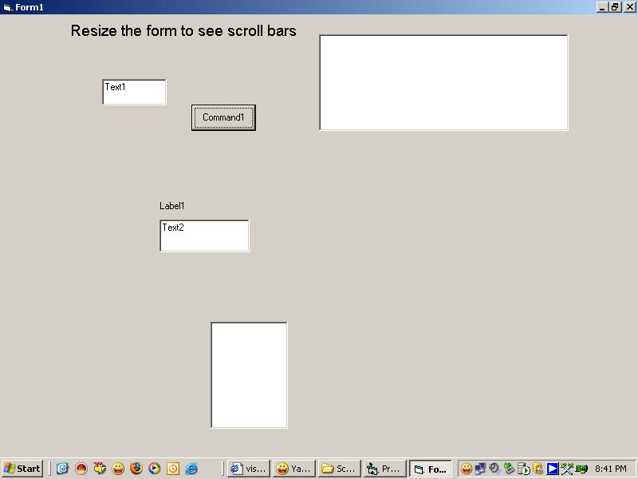



## Scrolling Form

### Description

This code shows how to make a scrolling form. I have tried to make it as clear as possible.

Please don't forget to vote for my code

Thanks to all the users

Thanks to PSC, the heaven for aspiring programmers
 
### More Info
 

             |
---                |---
**Submitted On**   |2007-10-15 10:21:32
**By**             |[Raman Mehta](https://github.com/Planet-Source-Code/PSCIndex/blob/master/ByAuthor/raman-mehta.md)
**Level**          |Intermediate
**User Rating**    |4.3 (13 globes from 3 users)
**Compatibility**  |VB 6\.0
**Category**       |[Miscellaneous](https://github.com/Planet-Source-Code/PSCIndex/blob/master/ByCategory/miscellaneous__1-1.md)
**World**          |[Visual Basic](https://github.com/Planet-Source-Code/PSCIndex/blob/master/ByWorld/visual-basic.md)
**Archive File**   |[Scrolling\_20870910142007\.zip](https://github.com/Planet-Source-Code/raman-mehta-scrolling-form__1-69492/archive/master.zip)

